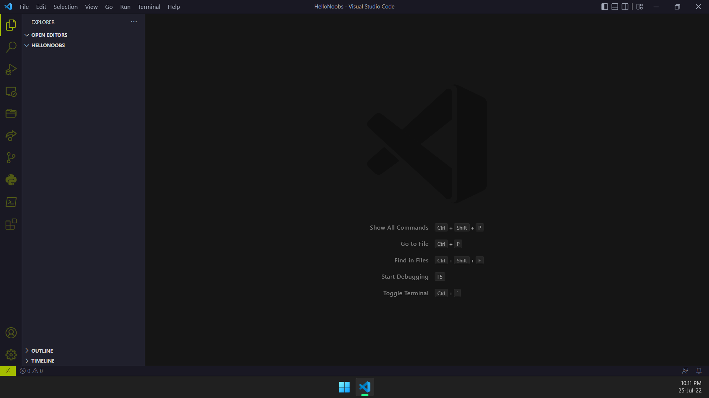

## Overview

Virutal Environment is an room for you to play atound your python project without effect your computer and other projects.

This file will teachs you how to create python virtual environment and how to activate/deactivate it in vscode.

## Step

### Step 1 

Open your 'project folder'

